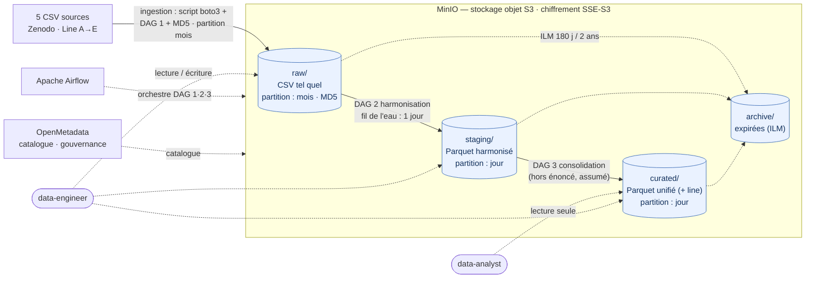

# Dossier d'architecture — Data Lake IoT industriel (C18)

> Modélisation de l'architecture en couches et justification des choix techniques.
> Le **schéma technique annoté** est le diagramme **Mermaid** du §2 (rendu nativement sur GitHub ;
> export `architecture.pdf` pour le livrable formel). L'analyse des données qui fonde ces choix est
> dans [notebooks/exploration_jour1.ipynb](../notebooks/exploration_jour1.ipynb).

## 1. Objectif & périmètre

Centraliser, documenter, sécuriser et gouverner les données de **5 lignes de production**
instrumentées (température, pression, temps de fonctionnement), en vue d'un futur projet de
**maintenance prédictive**. Le brief fait foi : voir [ennonce.md](../ennonce.md).

Volumétrie analysée (Jour 1) : **30 000 enregistrements** au total, **1 relevé/minute**,
couvrant **janvier→mai 2025** (un mois distinct par ligne), **~1 % d'anomalies** (`label=1`).

## 2. Vue d'ensemble

- **Stockage objet** : MinIO (compatible S3), 4 buckets = 4 couches.
- **Orchestration** : Airflow — **3 DAGs** : (1) **ingestion brute** → `raw`, (2) **harmonisation**
  → `staging`, (3) **consolidation** → `curated`. Les 2 premiers sont **requis par le brief** ; le 3ᵉ
  est une **décision** (cf. §11).
- **Catalogue / gouvernance** : OpenMetadata (fiches, propriétaires, qualité).
- **Cycle de vie** : règles ILM MinIO (archivage puis suppression).

## 3. Architecture en couches

| Couche | Rôle | Contenu & format | Partitionnement | Producteur → Consommateur |
|---|---|---|---|---|
| **raw/** | données brutes *telles que reçues*, jamais modifiées | CSV d'origine **copié tel quel** (byte-identique) | `production_lines/lineX/year=YYYY/month=MM/` | DAG ingestion → DAG harmonisation |
| **staging/** | données **nettoyées & harmonisées** | schéma unifié, **Parquet** | `production_lines/lineX/year=YYYY/month=MM/day=DD/` | DAG harmonisation → consolidation |
| **curated/** | données **prêtes à l'analyse** | table **unifiée** des 5 lignes (+ colonne `line`), **Parquet** | `sensor_readings/line=lineX/year=YYYY/month=MM/day=DD/` | DAG consolidation → `data-analyst`, futurs modèles ML |
| **archive/** | données **expirées** | objets déplacés par l'ILM | conservé tel quel | cycle de vie automatique |

### 3.1 `raw/` — zone d'atterrissage
- Copie **fidèle** des CSV sources : on n'y corrige **rien** (casse des colonnes, formats hétérogènes conservés). C'est la « source de vérité » rejouable.
- **Fichier copié tel quel** dans sa partition : `raw/production_lines/lineX/year=YYYY/month=MM/<fichier>.csv`.
  `line` vient du nom de fichier ; `year`/`month` sont déterminés à partir des **données** (le mois
  du `timestamp`). Un **fichier source couvre systématiquement un seul mois** → un fichier = une
  partition, déposé **byte-identique** à la source. Aucune transformation ici (typage et
  harmonisation : en `staging`).
- **Intégrité** : on vérifie que le **MD5 du fichier déposé** est **identique à celui de la source**
  (exigence du brief, Jour 2) — garanti par la copie byte-identique.
- **Garde-fou impératif** : vérifier que tous les `timestamp` du fichier tombent dans le **même
  mois** ; **sinon, échec de l'ingestion** (un fichier multi-mois invaliderait la copie en une seule
  partition → risque de mauvaise affectation silencieuse).

### 3.2 `staging/` — harmonisation
Transformations appliquées (cf. schéma cible §6 et contrat §12) :
- noms de colonnes **normalisés en minuscules** (`Temperature`→`temperature`, etc.) ;
- `timestamp` parsé et **normalisé ISO 8601** (UTC supposé) ;
- `elapsed_time` rendu **nullable** (absent des lignes C/D/E → **`NULL`**) ;
- schéma de sortie **identique pour les 5 lignes** (cf. §6).

**Partitionnement au jour** (≠ `raw` au mois) : `staging/production_lines/lineX/year=YYYY/month=MM/day=DD/`.
**Traitement au fil de l'eau** : le DAG `raw → staging` traite **un jour à la fois** (planifié
quotidiennement) → **simule un flux** ; LineA (~7 jours de données) ⇒ ~7 exécutions, etc.
⚠️ La **granularité jour** (partition + cadence) **n'est pas imposée par l'énoncé** — décision
assumée (cf. §11).

### 3.3 `curated/` — prêt à l'analyse
- **Table unifiée** des 5 lignes, avec colonne `line` pour distinguer la provenance.
- C'est la couche que consomme le `data-analyst` et qu'exploitera le futur modèle de
  maintenance prédictive (historique homogène multi-équipements).
- Partitionnée au **jour** également (`…/day=DD/`), cohérente avec `staging`.
- Peuplée par un **3ᵉ DAG `staging → curated`** (« consolidation »). ⚠️ **Non demandé par
  l'énoncé** (qui ne requiert que 2 DAGs : ingestion + harmonisation) ; **décision prise** pour
  **rester cohérent avec la gestion du flux** déjà en place en amont — *une couche = un DAG dédié*,
  pour un pipeline homogène et idempotent de bout en bout (cf. §11).

### 3.4 `archive/` — expiration
- Alimenté **automatiquement** par les règles ILM de MinIO (pas de DAG dédié).
- Politique : **archivage après 180 jours**, **suppression après 2 ans** (cf. C20).

## 4. Partitionnement

| Couche | Schéma | Justification |
|---|---|---|
| raw | `production_lines/lineX/year=YYYY/month=MM/` (au **mois**) | **imposé** par le brief ; permet le dépôt des fichiers **tels quels** + MD5 ; trace ligne et période |
| staging | `production_lines/lineX/year=YYYY/month=MM/day=DD/` (au **jour**) | granularité fine alignée sur le **traitement au fil de l'eau** (un jour à la fois) et les requêtes journalières |
| curated | `sensor_readings/line=lineX/year=YYYY/month=MM/day=DD/` (Hive `clé=valeur`, au **jour**) | élagage par ligne, mois **et jour** (requêtes analytiques fines) |

> **Deux granularités (décision, cf. §11) :** `raw` au **mois** (dépôt fichier + MD5) ;
> `staging`/`curated` au **jour**. Ce choix de granularité aval **n'est pas imposé par l'énoncé**.
> La règle de **dérivation des partitions** est détaillée dans le **contrat** (§12, règles 9‑12 + note).

## 5. Formats par couche

| Couche | Format | Pourquoi |
|---|---|---|
| raw | **CSV** | fidélité à la source ; aucun retraitement |
| staging / curated | **Parquet** | colonnaire, **typé**, **compressé**, lecture sélective de colonnes → adapté à l'analytique et au futur ML ; partitions Hive natives |

## 6. Schéma de données cible (staging & curated)

| Colonne | Type | Nullable | Unité | Provenance |
|---|---|---|---|---|
| `timestamp` | datetime (ISO 8601, UTC) | non | — | parsé depuis la source |
| `temperature` | float | non | °C | colonne renommée en minuscules |
| `pressure` | float | non | bar | colonne renommée en minuscules |
| `elapsed_time` | float | **oui** | arbitraire (temps de fonctionnement machine) | absente de C/D/E → **`NULL`** (manquant) |
| `label` | entier {0,1} | non | — | cible anomalie (0=nominal, 1=anomalie) |
| `line` | catégorie | non | — | dérivée du nom de fichier (`lineA`…`lineE`) |
| `year`, `month`, `day` | entier / texte | non | — | colonnes de partition (extraites du `timestamp` ; `day` en staging/curated) |

**Clé naturelle (logique) :** `(line, timestamp)` — identifie **un relevé et un seul**.
`timestamp` **seul ne suffit pas** : plusieurs lignes peuvent partager un horodatage (flux
simultané) ; dans ce jeu elles ne se chevauchent que par **coïncidence de mois** — à ne pas
exploiter. Au sein d'une ligne, `timestamp` est unique (vérifié Jour 1). MinIO/Parquet n'imposent
pas de contrainte de clé : elle est **garantie par le pipeline** (dédoublonnage à l'écriture, cf.
règle 16). Les colonnes de partition `line`/`year`/`month` dérivent de cette clé.

> **Source des unités :** `temperature` en **°C**, `pressure` en **bar** d'après
> [`data/How_to_Use.pdf`](../data/How_to_Use.pdf). La description détaillée
> (`Synthetic Data from Industrial Sensor.pdf`) les qualifie d'« *arbitrary units* » :
> divergence **tranchée en faveur de `How_to_Use.pdf`**. `elapsed_time` = « *machine runtime,
> arbitrary units* » → unité **arbitraire** (non spécifiée).

## 7. Conventions de nommage

- **Identifiant de ligne** : motif `Line([A-E])` du nom de fichier → `lineA`…`lineE`.
- **Buckets** : `raw`, `staging`, `curated`, `archive` (un par couche).
- **Partitions** : `key=value` (Hive) pour `year`/`month`/`day` ; segment simple `lineX` en raw/staging (conforme au brief). `raw` au **mois**, `staging`/`curated` au **jour**.

## 8. Cycle de vie des données (ILM)

| Étape | Délai | Action MinIO |
|---|---|---|
| Données actives | 0–180 j | conservées en `raw`/`staging`/`curated` |
| Archivage | > 180 j | transition vers `archive/` |
| Suppression | > 2 ans | expiration (suppression définitive) |

*(Configuration détaillée et captures : livrable C20.)*

## 9. Sécurité & gouvernance (aperçu — détail en C21)

- **3 rôles différenciés** : `data-analyst` (lecture seule sur `curated/`),
  `data-engineer` (lecture/écriture sur `raw/` + `staging/` + `curated/`), `admin` (tous droits).
- **Chiffrement SSE-S3** sur les buckets de production.
- **Logs d'audit** MinIO activés et analysés.

## 10. Justification des choix (volumétrie & fréquence)

- **Pourquoi une architecture en couches ?** Séparer les responsabilités (brut / nettoyé /
  analysable), garantir la **reproductibilité** (le brut n'est jamais retouché, tout est
  rejouable), améliorer la qualité **progressivement**, et tracer le cheminement de la donnée.
- **Pourquoi ce partitionnement (deux granularités) ?** `raw` au **mois** (`lineX/year/month`) :
  imposé par le brief et permet de **déposer les fichiers tels quels** (+ MD5), chaque fichier
  couvrant un mois. `staging`/`curated` au **jour** (`…/day=DD/`) : granularité fine alignée sur le
  **traitement au fil de l'eau** (un jour à la fois) et les **requêtes journalières** ; permet
  l'**élagage** précis et colle au futur flux continu. *(Granularité aval = décision, cf. §11.)*
- **Pourquoi MinIO ?** Stockage objet **compatible S3** (donc `boto3` standard), déployable
  localement, avec policies, chiffrement et ILM intégrés.
- **Pourquoi CSV→Parquet ?** CSV garde la source intacte en `raw` ; Parquet en aval apporte
  typage, compression et lecture colonnaire — essentiels dès que le volume croît et pour le ML.
- **Pourquoi un traitement au fil de l'eau (jour par jour) ?** Le DAG `raw → staging` traite
  **un jour à la fois** (planifié quotidiennement) pour **simuler un flux** temps réel — c'est notre
  réalisation de l'exigence « traiter LineA par chunks pour simuler un flux » du brief. LineA
  (~7 jours de données) ⇒ ~7 exécutions journalières.

## 11. Décisions retenues & hypothèses ouvertes

**Décisions retenues** :
- `staging`/`curated` en **Parquet** (vs CSV) — gain analytique.
- `curated` = **table unifiée** des 5 lignes avec colonne `line` — cohérent avec l'objectif
  maintenance prédictive (historique multi-équipements homogène).
- `raw` = **copie des fichiers source tels quels** (byte-identique) dans leur partition
  `lineX/year/month`, avec **vérification MD5** du fichier déposé — conforme au brief (« uploader
  les CSV » + « intégrité des fichiers déposés », Jour 2). Repose sur le fait **documenté** qu'un
  fichier source couvre **un seul mois** (garde-fou **impératif** : échec si le mois n'est pas unique).
- **3ᵉ DAG `staging → curated`** (« consolidation ») : **non requis par l'énoncé** (2 DAGs demandés :
  ingestion brute + harmonisation). **Décision assumée** pour **rester cohérent avec la gestion du
  flux** déjà prévue en amont — *une couche = un DAG dédié* → pipeline homogène, traçable et
  idempotent de `raw` jusqu'à `curated`.
- **Partitionnement à deux granularités + traitement au fil de l'eau** : `raw` au **mois** (pour
  déposer les fichiers tels quels + MD5) ; `staging`/`curated` au **jour** (`…/day=DD/`), et le DAG
  `raw → staging` traite **un jour à la fois**. Ce dispositif **réalise** l'exigence « simuler un
  flux / chunks » du brief, mais le **choix du jour** (granularité aval + cadence) **n'est pas
  imposé par l'énoncé** : **décision assumée** pour un flux cohérent et des requêtes fines.

- **Schéma en Mermaid** (plutôt que draw.io, *suggéré* par le brief) : **diagramme-as-code**,
  versionnable et *diffable*, **rendu nativement sur GitHub**, cohérent avec l'approche reproductible
  du dépôt. Le livrable « PDF / draw.io » est satisfait par un **export PDF**. *(Choix au titre de la
  « justification des choix » du C18 ; draw.io reste possible si un rendu « poster » est exigé.)*

**Hypothèses à lever** (cf. notebook) :
- **Fuseau horaire** du `timestamp` : non précisé par la source → supposé **UTC**, à documenter.
- **Écart doc ↔ données** sur le taux d'anomalies (LineE annoncé 0 %, mesuré 0,5 %) : la donnée
  fait foi ; à consigner comme avertissement qualité en C20.

## 12. Règles d'implémentation de l'import (contrat)

Contrat que doit respecter le script/DAG d'ingestion (`raw/`) et d'harmonisation
(`staging/`). Les faits sont décrits aux §3–§9 ; cette liste en est la **checklist
actionnable**, source de référence pour les DAGs (Jours 3‑4).

### Lecture des fichiers
1. CSV : séparateur `,`, décimale `.`, encodage **UTF‑8**, en‑tête présent (1 ligne). Fixer ces paramètres explicitement.
2. **Ne pas se fier à l'ordre des colonnes** (il varie) : adresser chaque colonne par son **nom normalisé**.
3. **Ne pas se fier au nombre de colonnes** (4 ou 5 selon la ligne).

### Harmonisation des colonnes (→ `staging/`, schéma cible §6)
4. **Normaliser tous les noms de colonnes en minuscules** (`Temperature`→`temperature`, `Pressure`→`pressure`, `Elapsed_time`→`elapsed_time`).
5. **`elapsed_time` optionnel** : si absent (LineC/D/E), créer la colonne avec une valeur **manquante (`NULL`)** — en pandas via `NaN`/`pd.NA`, **persistée en `NULL`** dans Parquet (jamais un sentinelle comme `0`). Ne jamais présumer sa présence.
6. Produire le **schéma cible figé du §6** (mêmes colonnes, mêmes types) quel que soit le fichier d'entrée.

### Typage / parsing
7. `timestamp` : parser explicitement `%Y-%m-%d %H:%M:%S` → datetime, **normaliser en ISO 8601** ; fuseau **supposé UTC** (à documenter).
8. `temperature`, `pressure`, `elapsed_time` → `float` ; `label` → entier `{0, 1}`.

### Partitionnement (cf. §4)
9. Chemin de dépôt : `raw/production_lines/{line}/year={YYYY}/month={MM}/<fichier>.csv`.
10. `line` (`lineA`…`lineE`) se déduit du **nom de fichier** (motif `Line([A-E])`) — un fichier = une ligne de production.
11. **`year` / `month` se déduisent des données** (le mois du `timestamp`), pas du nom de fichier. Un **fichier source couvre systématiquement un seul mois** → **un fichier = une partition**.
12. **Le fichier est copié tel quel** (byte-identique) dans sa partition — **pas de ré-écriture ni de scission** en `raw`. Conforme au brief (« uploader les CSV » + « vérifier l'intégrité des fichiers déposés »). **Garde-fou impératif** : vérifier que tous les `timestamp` du fichier tombent dans le **même mois** ; **sinon, échouer l'ingestion** (fichier source non conforme à l'hypothèse de partitionnement).

> **Note (raw vs aval) :** `raw` = **copie du fichier brut**, partitionné au **mois** (aucune
> transformation). `staging`/`curated` sont partitionnés au **jour** (`…/day=DD/`, `day` dérivé du
> `timestamp`) et le DAG `raw → staging` traite **un jour à la fois** (fil de l'eau, cf. §11). Le
> **typage et l'harmonisation** (règles 4‑8) n'interviennent qu'en `staging`.

### Intégrité
13. **Intégrité (MD5)** : au **téléchargement** (fidélité Zenodo → `data/`) **et** sur le **fichier
    déposé** en `raw` — le MD5 du fichier déposé doit être **identique à celui de la source** (copie
    byte-identique). Exigence directe du brief (Jour 2).

### Traitement au fil de l'eau (simulation de flux)
14. Le DAG `raw → staging` traite **un jour à la fois** (planifié quotidiennement) → **simule un flux** temps réel. C'est la réalisation de l'exigence « traiter LineA par chunks pour simuler un flux » du brief ; LineA (~7 jours) ⇒ ~7 exécutions. *(Granularité jour = décision hors énoncé, cf. §11.)*
15. Chaque exécution alimente la partition `…/day=DD/` de `staging` ; **idempotente par jour** (ré-exécuter un jour réécrit sa partition, cf. règle 16).

### Idempotence & reproductibilité
16. L'ingestion doit être **relançable sans créer de doublons** : clé de **dédoublonnage / fusion = `(line, timestamp)`** (clé naturelle, cf. §6) ; chemins/objets **déterministes**, écrasement contrôlé.
17. Tout réglage (identifiant de dépôt, chemins, secrets) provient de la **configuration / variables d'environnement**, jamais de valeurs en dur.

## 13. Livrable visuel

Le **schéma technique annoté** est le diagramme **Mermaid** du §2 : il reprend le flux
(sources → raw → staging → curated → archive), les briques (MinIO, Airflow, OpenMetadata) et les
annotations (partitions mois/jour, formats, MD5, SSE-S3, ILM, rôles d'accès). Il est **rendu
nativement sur GitHub** et exploitable par un tiers. Pour le rendu formel : **export `architecture.pdf`**
(via l'extension Mermaid de VSCode ou `mermaid-cli`).
